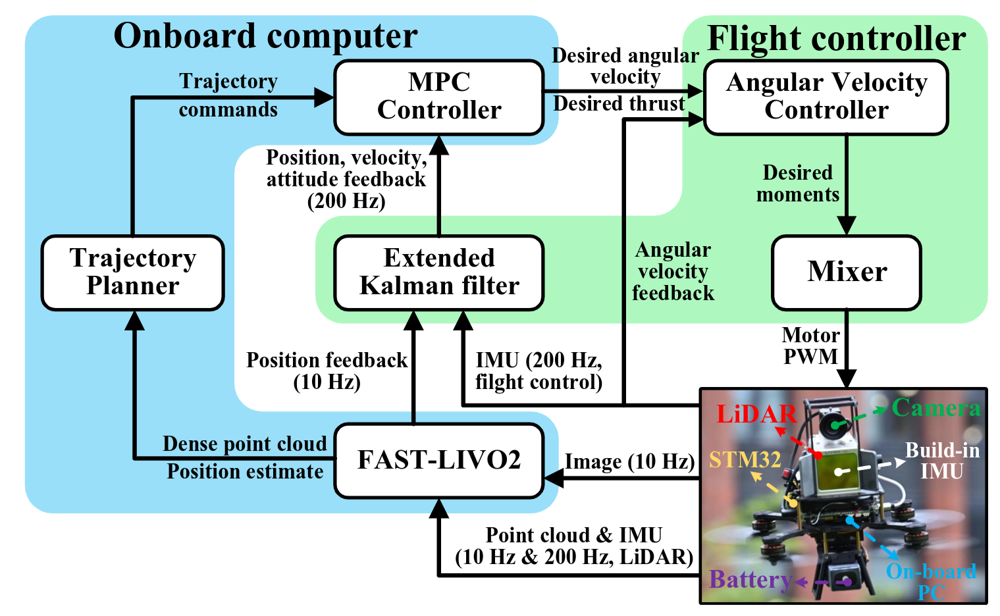

<div align="center">
    <h2>SUPER: Safety-assured High-speed Navigation for MAVs</h2>
    <strong>Science Robotics' 25</strong>
    <br>
        <a href="https://github.com/RENyunfan" target="_blank">Yunfan REN</a>,
<a href="https://github.com/zfc-zfc" target="_blank">Fangcheng Zhu</a>,
    <a href="https://github.com/genegzl" target="_blank">Guozheng Lu</a>,
    <a href="https://github.com/Ecstasy-EC" target="_blank">Yixi Cai</a>,
    <a href="https://github.com/YLJ6038" target="_blank">Longji Yin</a>,
    <a href="https://github.com/jackykongfz" target="_blank">Fanze Kong</a>,
    <a href="https://github.com/ziv-lin" target="_blank">Jiarong Lin</a>,
    <a href="https://github.com/lawrence-cn" target="_blank">Nan Chen</a>, and
        <a href="https://mars.hku.hk/people.html" target="_blank">Fu Zhang</a>
    <p>
        <h45>
            <br>
           
            <br>
        </h5>
    </p>
    <a href='https://www.science.org/doi/10.1126/scirobotics.ado6187'></a>
    <a href="https://www.bilibili.com/video/BV1BSFgeJEJn/"></a>
    <a href="https://youtu.be/GPHuzG0ANmI?si=npW-FNp1rkQQ5YaF"></a>
</div>


# Updates
* **Mar. 09, 2025** - The hardware components of SUPER have been released at [SUPER-Hardware](https://github.com/hku-mars/SUPER-Hardware) 🦾
* **Jan. 29, 2025** - The preview version of SUPER's planning module, supporting both ROS1 and ROS2, is now available! Try it out, and we welcome any issues or contributions.
* **Jan. 29, 2025** - The paper of SUPER is now featured on the official website of [*Science Robotics*](https://www.science.org/doi/10.1126/scirobotics.ado6187).
* **Dec. 12, 2024** - 🎉 Our paper has been accepted by *Science Robotics*! 

Our paper is also aviliable at [here](misc/scirobotics.ado6187.pdf). If our repository supports your academic projects, please cite our work. Thank you!

```tex
@article{ren2025safety,
  title={Safety-assured high-speed navigation for MAVs},
  author={Ren, Yunfan and Zhu, Fangcheng and Lu, Guozheng and Cai, Yixi and Yin, Longji and Kong, Fanze and Lin, Jiarong and Chen, Nan and Zhang, Fu},
  journal={Science Robotics},
  volume={10},
  number={98},
  pages={eado6187},
  year={2025},
  publisher={American Association for the Advancement of Science}
}

@article{lu2025autonomous,
  title={Autonomous Tail-Sitter Flights in Unknown Environments},
  author={Lu, Guozheng and Ren, Yunfan and Zhu, Fangcheng and Li, Haotian and Xue, Ruize and Cai, Yixi and Lyu, Ximin and Zhang, Fu},
  journal={IEEE Transactions on Robotics},
  year={2025},
  publisher={IEEE}
}

@inproceedings{ren2024rog,
  title={Rog-map: An efficient robocentric occupancy grid map for large-scene and high-resolution lidar-based motion planning},
  author={Ren, Yunfan and Cai, Yixi and Zhu, Fangcheng and Liang, Siqi and Zhang, Fu},
  booktitle={2024 IEEE/RSJ International Conference on Intelligent Robots and Systems (IROS)},
  pages={8119--8125},
  year={2024},
  organization={IEEE}
}
```

# 1 Highlights

## 1.1 Autonomous Navigation in Challenging Environments
(Click for video demo)
[](https://youtu.be/GPHuzG0ANmI?si=W83mDMxqfgWReWPF)

## 1.2 Applications: Object Tracking & Autonomous Exploration

SUPER has been successfully deployed in various applications, including large-scale autonomous exploration in an ongoing project by [@jackykongfz](https://github.com/jackykongfz) and [@ZbyLGsc](https://github.com/ZbyLGsc) from [STAR Lab](sysu-star.com), among others, as well as object tracking under both day and night conditions.


> ⬆️ This segment is from an unpublished work by Kong [[@jackykongfz](https://github.com/jackykongfz) ] et al., conducted in collaboration with [STAR Lab](sysu-star.com), using SUPER.


## 1.3 Supported Projects

### 1.3.1 Autonomous Tail-Sitter (TRO '25)

Building on SUPER, a similar planning system has been successfully validated in [Autonomous Navigation for Tail-Sitter UAVs](https://github.com/hku-mars/EFOPT)  by [@genegzl](https://github.com/genegzl)  et al.


### 1.3.2 FAST-LIVO2 (TRO '24)
SUPER serves as the flight platform and navigation system in the video demonstration of [FAST-LIVO2: Fast, Direct LiDAR-Inertial-Visual Odometry](https://github.com/hku-mars/FAST-LIVO2) by [@xuankuzcr](https://github.com/xuankuzcr) et al.



# 2 Quick Start

## 2.1 Installation

Install dependencies

```bash
# for MARSIM example
sudo apt-get install libglfw3-dev libglew-dev libncurses5-dev libncursesw5-dev
# Eigen [version testd: 3.3.7-2] and soft link 
sudo apt-get install libeigen3-dev       
sudo ln -s /usr/include/eigen3/Eigen /usr/include/Eigen
# dw for backward cpp
sudo apt-get install libdw-dev
# for ROS dependency
sudo apt-get install ros-${YOUR-ROS-VERSION}-mavros* ros-${YOUR-ROS-VERSION}-pcl* ros-${YOUR-ROS-VERSION}-rosfmt
```

Before building the code, select the appropriate ROS version:

```bash
# Use ROS1-noetic
bash ${PATH-TO-SUPER}/SUPER/scripts/select_ros_version.sh ROS1
# Use ROS2
bash ${PATH-TO-SUPER}/SUPER/scripts/select_ros_version.sh ROS2
```

Tested Environments:

* Ubuntu 20.04 + ROS1 Noetic
* Ubuntu 20.04 + ROS2 foxy
* ...

Currently, **ROS1 Noetic** serves as the **Tier 1** supported platform for SUPER. The ROS2 version is still under development and may be unstable, with some issues such as imperfect visualization. We are actively working on improvements.

### Known Build issues

* ...

## 2.2  ROS1 (Noetic) Installation
```bash
mkdir -p super_ws/src && cd super_ws/src
git clone https://github.com/hku-mars/SUPER.git
cd ..
catkin_make -DBUILD_TYPE=Release
```

To test, use one of the following commands:

1. **High-Speed Navigation**

```bash
cd ${PATH-TO-WS}
source devel/setup.bash
roslaunch mission_planner benchmark_high_speed.launch
```

2. **Agile Flight in Dense Environments**

```bash
cd ${PATH-TO-WS}
source devel/setup.bash
roslaunch mission_planner benchmark_dense.launch
```

3. **Click and Go Demo**

```
roslaunch mission_planner click_demo.launch 
```
In the click demo, press `G` to enable the `2D Goal Pose` plugin, then click a position in RViz to set the goal.
## 2.3 ROS2


```bash
mkdir -p super_ws/src && cd super_ws/src
git clone https://github.com/hku-mars/SUPER.git
cd ..
colcon build --symlink-install
# add to debug:  --event-handlers console_direct+ 
```

To test, run:

1. **High-speed Navigation**

```bash
cd ${PATH-TO-WS}
source install/local_setup.bash
ros2 launch mission_planner benchmark_high_speed.launch.py
```

2. **Agile flights in dense enviroment**

```bash
cd ${PATH-TO-WS}
source install/local_setup.bash
ros2 launch mission_planner benchmark_dense.launch.py     
```

3. **Click demo**

```
ros2 launch mission_planner click_demo.launch.py
```

### Real-world deployment

A detailed guide for deploying SUPER on real-world hardware will be available soon. In the meantime, you can refer to [issue #5](https://github.com/hku-mars/SUPER/issues/5) for some helpful hints.

## 2.4 Use Your Own Map

SUPER allows users to load their own **.pcd** maps as simulation environments. To do so:

1. Place your **.pcd** file in:
   **[./mars_uav_sim/perfect_drone_sim/pcd/](./mars_uav_sim/perfect_drone_sim/pcd)**
2. Modify the `pcd_name` parameter in the corresponding YAML file located at:
   **[./mars_uav_sim/perfect_drone_sim/config](./mars_uav_sim/perfect_drone_sim/config)**

This enables seamless integration of custom maps for simulation. 

## 2.5 Logging System

SUPER includes a built-in logging system that records each run automatically. Logs are saved in:

- **[./super_planner/log/cmd_logs](./super_planner/log/cmd_logs)**
- **[./super_planner/log/replan_logs](./super_planner/log/replan_logs)**

After stopping the program with `Ctrl + C`, the latest log will be saved. Users can evaluate **trajectory quality** by running:

```bash
# Install dependencies
pip3 install numpy pandas matplotlib

# Plot the command log
python3 plotCmdLog.py
```

For advanced usage, refer to:

- **[read_replan_log.cpp](super_planner/Apps/read_replan_log.cpp)**
- **[traj_opt_tuning.cpp](super_planner/Apps/traj_opt_tuning.cpp)**

We are actively working on improving the logging system, and updates will be available soon! 

## 2.6 Tuning

To maximize performance, parameter tuning is crucial. The current version of SUPER has a large number of parameters (maybe TOOOO MUCH), requiring careful adjustment. Users can refer to the provided examples for guidance. We plan to provide detailed tuning instructions soon. In the meantime, feedback and issue reports are welcome.

## 2.7 Notable Known Issues
* [#10]: When using SUPER with your own simulator (e.g., Gazebo) or a LiDAR odometry system other than FAST-LIO2, ensure that the input point cloud is provided in the world frame. ROG-Map does not utilize `frame_id` or `/tf` information and assumes by default that all input point clouds are in the world frame rather than the body frame.

# 3 TODO

* Add a demo for autonomous exploration (SUPER is well-suited as a local planner for point-to-point navigation).
* Provide examples for using standalone tools in SUPER, such as:

  - **CIRI** - Generates safe flight corridors in C-space.

  - **ROG-Map** - An efficient occupancy grid map supporting both ROS1 and ROS2.
* Introduce the hardware components of SUPER.
* Detail the control module of SUPER.
* Develop a tutorial.


# 4. Acknowledgments

SUPER is built upon several outstanding open-source projects. We extend our gratitude to the developers of the following repositories:

* **[FAST_LIO](https://github.com/hku-mars/FAST_LIO)**, **[Swarm-LIO2](https://github.com/hku-mars/Swarm-LIO2)** and  **[LiDAR_IMU_Init](https://github.com/hku-mars/LiDAR_IMU_Init)**  for their excellent localization solutions.
* **[ROG-Map](https://github.com/hku-mars/ROG-Map)** - A high-performance mapping framework that influenced our approach to map representation and optimization.
* **[MARSIM](https://github.com/hku-mars/MARSIM)** - A simulation environment that played a key role in testing and evaluating our algorithms in virtual scenarios.
* **[GCOPTER](https://github.com/ZJU-FAST-Lab/GCOPTER)** – A valuable resource that efficiently performs differentiable trajectory optimization and serves as the foundation of our trajectory optimization method.

  **[FIRI](https://github.com/ZJU-FAST-Lab/GCOPTER/blob/main/gcopter/include/gcopter/firi.hpp)** – An extremely efficient safe flight corridor generation method upon which our CIRI is built.
* [**FASTER**](https://github.com/mit-acl/faster) - Introduces the initial concept of a two-trajectory optimization framework.
* **[DecompUtil](https://github.com/sikang/DecompUtil)** - A convex decomposition tool that was instrumental in implementing our algorithms.
* **[Mockamap](https://github.com/HKUST-Aerial-Robotics/mockamap)** - A simple ROS-based map generator that assisted in our development and testing.
* [**Nxt-FC**](https://github.com/HKUST-Aerial-Robotics/Nxt-FC) – A compact yet powerful hardware platform for the PX4 flight controller.

We sincerely appreciate the efforts of these communities in advancing robotics research.
